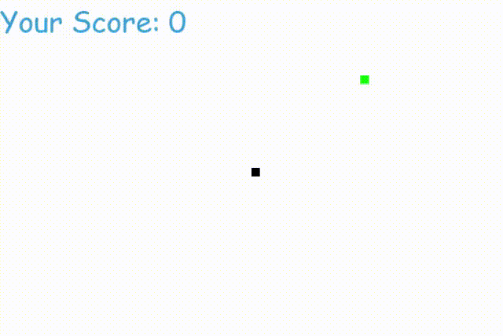

# Snake Game in Python

This project is a simple implementation of the classic Snake game using Python and the Pygame library. The objective of the game is to control a snake to eat food, which causes it to grow. The game ends when the snake collides with the screen's edge or with itself.




## Table of Contents
- [Installation](#installation)
- [How to Run](#how-to-run)
- [Game Rules](#game-rules)
- [Code Structure](#code-structure)
- [How to Play](#how-to-play)
- [Customizing the Game](#customizing-the-game)

## Installation

1. **Python**: Make sure you have Python installed on your system. You can download it from [python.org](https://www.python.org/downloads/)

2. **Pygame**: This project requires the Pygame library. Install it using pip:

   ```bash
   pip install pygame
   ```

## How to Run
Clone this repository or download the snake_game.py file.

Open a terminal (or command prompt) and navigate to the directory where the snake_game.py file is located.

Run the Python script:

```bash
python snake_game.py
```
The game window will open, and you can start playing the game.

## How to Play
Start the game by running the script.

Control the snake using the arrow keys:
- Left Arrow: Move left
- Right Arrow: Move right
- Up Arrow: Move up
- Down Arrow: Move down

Try to eat the green food squares. Each time the snake eats food, it grows longer.
Avoid running into the edges of the screen or into the snake's own body.
Your score increases with each piece of food eaten.

## Customizing the Game
You can modify various aspects of the game by editing the snake_game.py file:

**Snake Speed**: Change the snake_speed variable to make the game faster or slower.

**Snake Size**: Modify the snake_block variable to change the size of the snake and food.

**Colors**: Customize the colors by changing the RGB values defined at the top of the script.

**Game Over Message**: Change the text and position of the game over message in the message function.